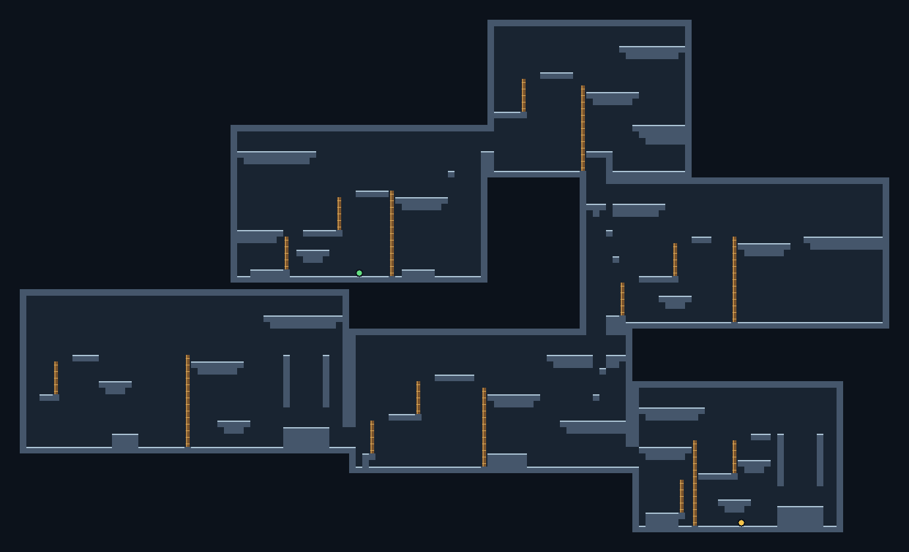

# Daedalus

Daedalus generates deterministic 2D maps from a configuration and seed. It has two generation paths: connected dungeon floors and platform maps with a movement-aware traversal graph. Use the Go SDK directly or run the stateless gRPC subprocess; the optional local debug UI lets you inspect both.


- **Dungeon layout:** weighted rectangle, L, T, cross and circle rooms; Poisson disk placement; connected corridors with configurable widths, shortcuts and connection limits.
- **Roles and assets:** Start, Boss and Treasure rooms, plus weighted room/corridor asset metadata for choosing your own prefabs. A role selects a room, not an entity spawn position.
- **Terrain:** optional palette-based patches with independent movement cost and transparency. Terrain names do not impose game rules.
- **Navigation and visibility:** distance fields, routes, chase/flee steps and symmetric-shadowcasting field of view, with terrain-aware inputs.
- **Keys and locks:** a separate gating plan names key rooms and door IDs, then checks room-graph solvability. Inventory, pickup placement and door behavior remain in your game.



- **Platform layout:** rooms with floors, ledges, upper galleries, ropes/ladders and opposing wall-jump surfaces, composed from a configurable rhythm vocabulary.
- **Player capabilities:** provide a movement profile (body size, gravity, speed, jump and optional dash, double jump, wall jump and climb) and a progression plan that grants abilities by stage. The [Silksong-inspired request](.github/assets/showcase-platform-request.json) uses illustrative parameters, not measured game physics.
- **Traversal graph:** directed motion edges and witnesses are built from the final room geometry. The debug view can filter surface connections by move type and inspect a selected surface, wall or rope.
- **Explicit verdict:** `CERTIFIED`, `REJECTED` or `UNKNOWN` reports the movement oracle's result. Certification covers the modeled room graphs and stamped runs; it is not a promise about your game's physics, visual quality or inter-room transition motion.

## Local debug UI

From the repository, start the opt-in HTTP interface:

```sh
go run ./cmd/daedalus --http-debug-enabled
```

Open [http://127.0.0.1:8090/debug/](http://127.0.0.1:8090/debug/). Choose **Dungeon** or **Platform** in the Request panel, paste a complete request, then generate. The [dungeon showcase request](.github/assets/showcase-request.json) reproduces the first image; the [platform showcase request](.github/assets/showcase-platform-request.json) reproduces the second. The View panel has zoom/fit and inspection controls. For platform maps, select a surface to inspect its traversal connections; dashed arrows show graph connectivity, not the actual flight path. The response panel exposes the returned ProtoJSON.

The debug server binds to loopback only and is disabled unless `--http-debug-enabled` is set. Its default address is `127.0.0.1:8090`; use `--http-debug-addr=127.0.0.1:<port>` to change the port.

## gRPC subprocess

Run `go run ./cmd/daedalus` (or the built `daedalus` binary) for the gRPC service without the HTTP UI. It writes one JSON handshake to stdout containing the transport, resolved address, PID and version; logs go to stderr. The default listener is an ephemeral loopback TCP port. Read the handshake and connect to that address rather than assuming a fixed gRPC port.

The [protocol](proto/daedalus/v1/daedalus.proto) defines `Generate`, `GeneratePlatform`, `ComputeSteps`, `ComputeVisibility` and `BuildGatingPlan`. Each call supplies its inputs; the service retains no generated map or gameplay state between requests. ProtoJSON represents a 64-bit seed as a decimal string.

## Go SDK

```sh
go get github.com/Otoru/daedalus
```

For a dungeon, the zero-value generator selects the built-in placement and connection algorithms:

```go
layout, err := (daedalus.Generator{}).Generate(daedalus.Config{
    Width: 92, Height: 92, Seed: 4242,
    MinDistance: 6, MaxRooms: 42,
    ExtraEdgeCount: 8, MaxRoomEdges: 3,
})
```

For a platform map, construct a complete `platform.Config` with dimensions, profile and beat vocabulary, then call `platform.Generate(ctx, platform.NewM1Oracle(), config)`. Inspect both `err` and `layout.Judgement`: a generated map may have a `REJECTED` or `UNKNOWN` verdict without a Go error. The [platform package](platform/) contains the model and tests; the [platform showcase request](.github/assets/showcase-platform-request.json) shows the wire configuration and ability masks.

[API documentation](https://pkg.go.dev/github.com/Otoru/daedalus) · [Runnable dungeon examples](example_test.go) · [Protocol](proto/daedalus/v1/daedalus.proto) · [Contributing](CONTRIBUTING.md) · [MIT license](LICENSE)
