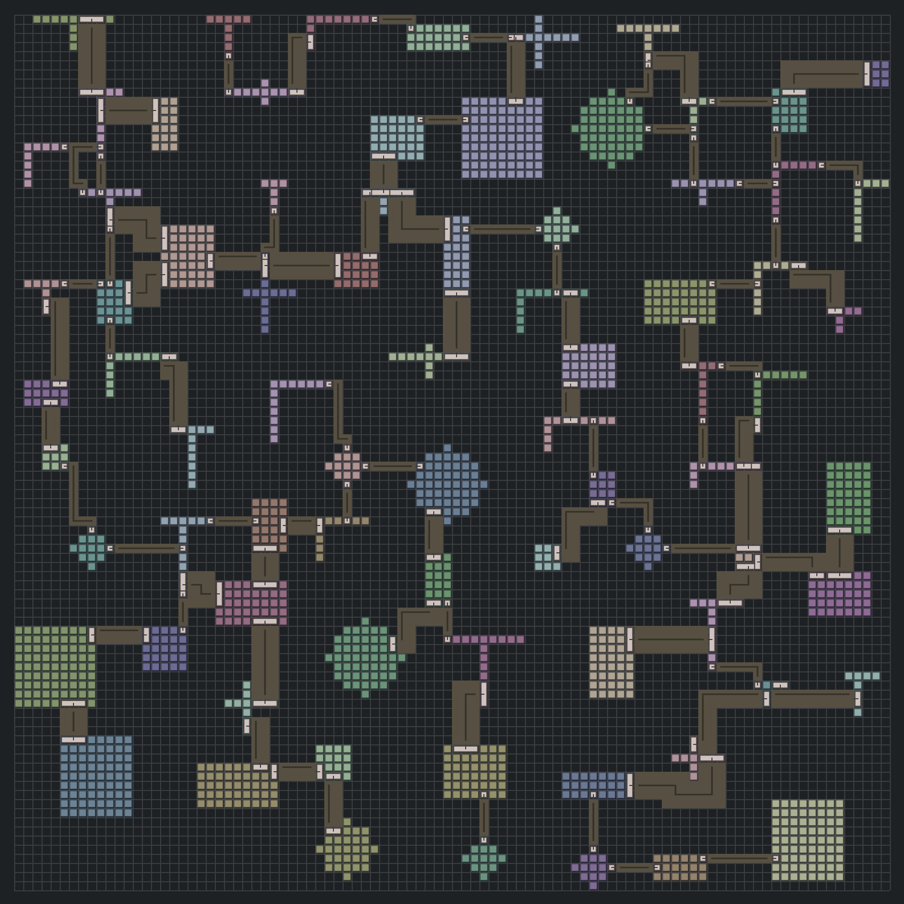

# Daedalus

Deterministic 2D dungeon generation for Go. One `Config` and one `Seed` in, one immutable `Layout` out: a grid of cells, rooms, corridors and doors.



## Features

- **Deterministic.** The same effective `Config` and `Seed` reproduce a `Layout` bit for bit, in the SDK and over gRPC, on amd64 and arm64. The output is frozen for the whole v1 major and pinned by golden fixtures.
- **No dependencies in the core.** The root package imports only the standard library, enforced by a test that parses its AST. gRPC, protobuf, fx and zap live outside it.
- **Rooms have shape.** Five canonical masks — rectangle, L, T, cross and circle — placed by Poisson disk over their real footprint, with a configurable gap between them.
- **Connected by construction.** A Prim spanning tree guarantees every room is reachable; `ExtraEdgeCount` adds cycles back on top of it.
- **Corridors have a width.** A weighted distribution, drawn per corridor, so a floor mixes tight passages with the occasional hall. Omit it and every corridor is one cell, as before.
- **Thematic roles.** Ask for a start, a boss and treasure rooms, and get them placed by distance rather than by luck.
- **Density regions.** Different room spacing per area of the same floor.
- **Three ways to run it.** Import it as a library, run it as a gRPC subprocess that announces itself on stdout, or open the local HTTP debug interface — the map above is a screenshot of it.
- **Bounded.** Grids up to 256×256, 65,536 cells, 256 rooms. A request over a limit is rejected before any allocation, never truncated.

## Input

The `Config` that produced the map above:

```go
config := daedalus.Config{
	Width: 96, Height: 96, CellSize: 1, Seed: 20260928,
	MinDistance: 7, MaxAttempts: 30, MaxRooms: 128,
	CorridorOrder:  daedalus.CorridorOrderXThenY,
	ExtraEdgeCount: 6,
	RoomRoleRequests: []daedalus.RoomRoleRequest{
		{Role: daedalus.RoomRoleStart, Count: 1},
		{Role: daedalus.RoomRoleBoss, Count: 1},
		{Role: daedalus.RoomRoleTreasure, Count: 3},
	},
	RoomGeometry: &daedalus.RoomGeometry{
		MinWidth: 3, MaxWidth: 9, MinHeight: 3, MaxHeight: 9,
		MaxFootprintCells: 81, MinRoomGap: 3,
		Shapes: []daedalus.RoomShapeWeight{
			{Shape: daedalus.RoomShapeRectangle, Weight: 4},
			{Shape: daedalus.RoomShapeL, Weight: 2},
			{Shape: daedalus.RoomShapeT, Weight: 2},
			{Shape: daedalus.RoomShapeCross, Weight: 1},
			{Shape: daedalus.RoomShapeCircle, Weight: 2},
		},
	},
	CorridorGeometry: &daedalus.CorridorGeometry{
		Widths: []daedalus.CorridorWidthWeight{
			{Width: 1, Weight: 5},
			{Width: 2, Weight: 3},
			{Width: 3, Weight: 2},
		},
	},
}

layout, err := daedalus.Generator{}.Generate(config)
```

Every field has a default except `Width` and `Height`. A nil `RoomGeometry` is the dynamic profile, not one-cell rooms; a nil `CorridorGeometry` is one-cell corridors. A corridor wider than the gap between two rooms cannot pass between them and degrades to a width that fits, so `MinRoomGap` is raised to 3 here to let the wide runs happen.

Over gRPC and HTTP the request is the same thing as ProtoJSON. Field names are the proto names, and `seed` is a decimal string because it is a `uint64`:

```json
{"config": {"width": 96, "height": 96, "seed": "20260928",
            "corridor_geometry": {"widths": [{"width": 2, "weight": 1}]}}}
```

## Output

```go
fmt.Printf("rooms=%d corridors=%d doors=%d cells=%d\n",
	len(layout.Rooms), len(layout.Corridors), len(layout.Doors), len(layout.Grid.Cells))

corridor := layout.Corridors[6]
fmt.Printf("corridor %d: centerline=%d band=%d\n", corridor.ID, len(corridor.Centerline), len(corridor.Cells))

door := layout.Doors[corridor.FromDoorID]
fmt.Printf("door %d: room=%d at=%v span=%d\n", door.ID, door.RoomID, door.At, door.Span)
```

```
rooms=78 corridors=83 doors=165 cells=9216
corridor 6: centerline=4 band=12
door 12: room=14 at={22 62} span=3
```

`Centerline` is the ordered route; `Cells` is the band it occupies, so a four-cell route three wide covers twelve. `Span` is how many boundary cells the doorway takes, never zero. `RoomID` is nil on anything but a room cell, and `CorridorIDs` is ascending, with two ids meaning two corridors share the cell.

Over HTTP and gRPC the same `Layout` comes back as ProtoJSON. The first cell of each kind, in row-major order, and one cell shared by two corridors — note that the first room cell belongs to room 70, because scan order is not `RoomID` order:

```json
{"at": {"x": 0, "y": 0}, "kind": "CELL_KIND_EMPTY", "corridor_ids": []}
{"at": {"x": 2, "y": 0}, "kind": "CELL_KIND_ROOM", "room_id": 70, "corridor_ids": []}
{"at": {"x": 40, "y": 0}, "kind": "CELL_KIND_CORRIDOR", "corridor_ids": [68]}
{"at": {"x": 6, "y": 14}, "kind": "CELL_KIND_CORRIDOR", "corridor_ids": [21, 22]}
```

## Reference

- [Package documentation](https://pkg.go.dev/github.com/Otoru/daedalus) — the whole API, and the long form of this contract.
- [`Config`](https://pkg.go.dev/github.com/Otoru/daedalus#Config) is the request, [`Layout`](https://pkg.go.dev/github.com/Otoru/daedalus#Layout) is the reply.
- [Examples](https://pkg.go.dev/github.com/Otoru/daedalus#pkg-examples) — runnable, and part of the test suite.

## Install

```
go get github.com/Otoru/daedalus
```

The subprocess and the debug interface:

```
go build -o bin/daedalus ./cmd/daedalus
./bin/daedalus --http-debug-enabled
```

Contributing and local tooling: [CONTRIBUTING.md](CONTRIBUTING.md). Licence: [MIT](LICENSE).
