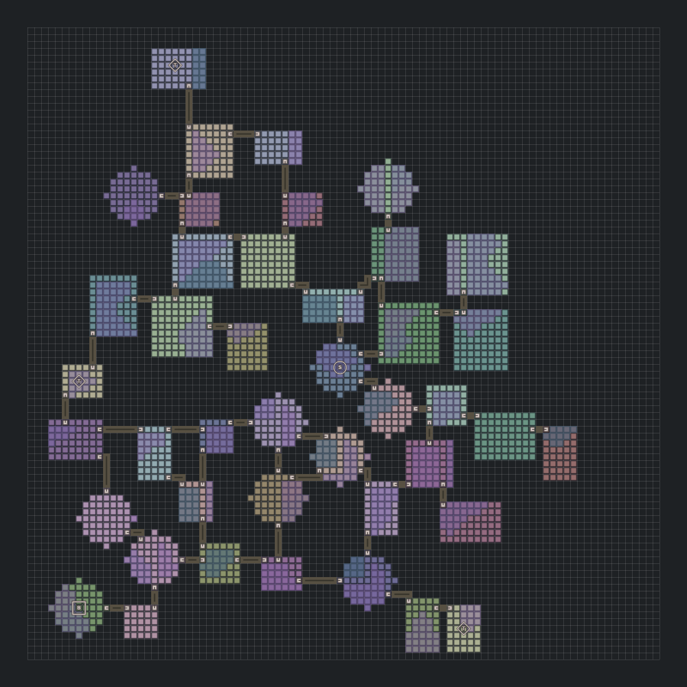
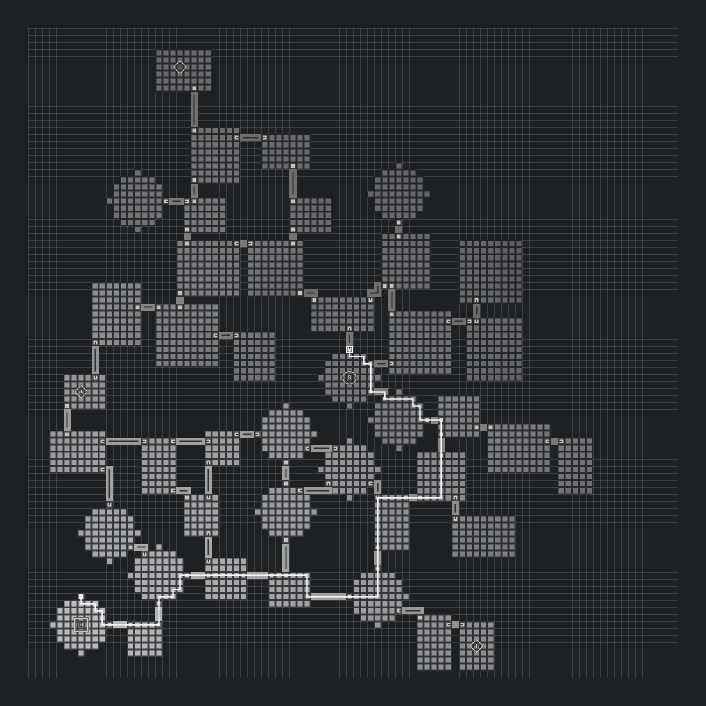
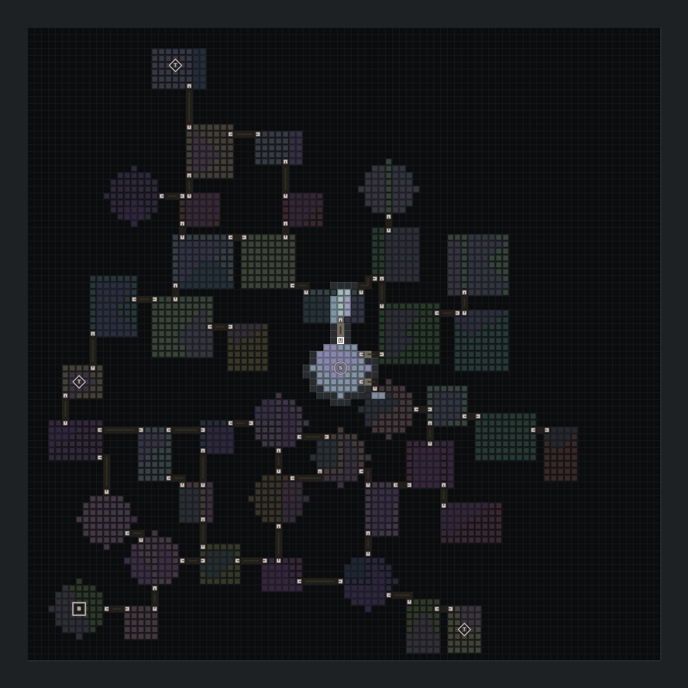
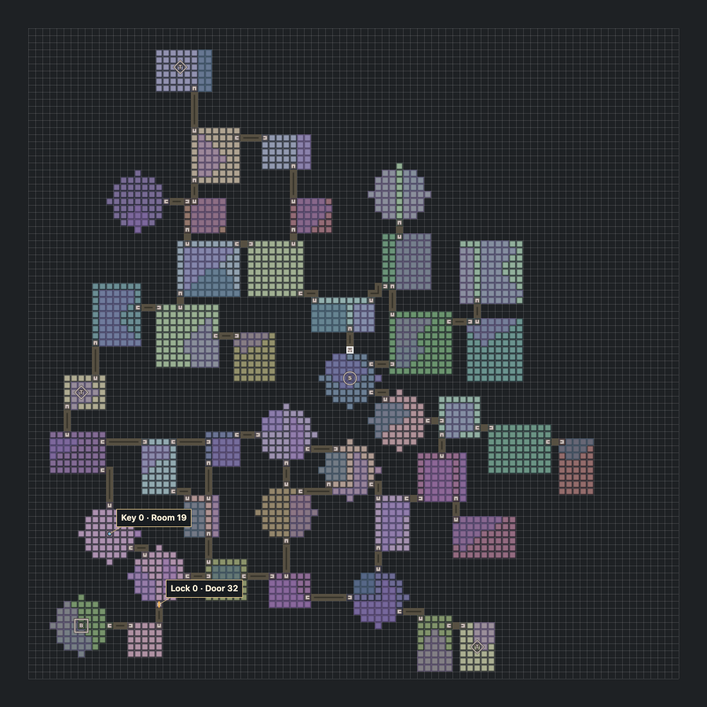

# Daedalus

Deterministic 2D dungeon generation for Go, with terrain, navigation, visibility and key/door progression. One `Config` and `Seed` produce a `Layout` of rooms, corridors, doors and cells. Use it directly in Go or through a gRPC subprocess.



**92×92 · seed 4242 · 42 rooms · 49 corridors.** Circle **S** marks Start, square **B** marks Boss, and diamonds **T** mark Treasure rooms. All four images on this page are full-canvas exports from the bundled demo using this [complete request](.github/assets/showcase-request.json).

## Shape the floor

- **Room geometry:** rectangle, L, T, cross and circle masks, each with its own weight and dimension ranges. Placement respects actual footprints, maximum room area and the requested gap. Circles use legal square, odd sizes with a centre cell.
- **Placement and density:** Poisson disk placement with configurable spacing, attempts and room count. `DensityRegions` lets different parts of the floor use different spacing.
- **Connected topology:** the default connector grows a spanning tree against the corridor router. `ExtraEdgeCount` adds shortcuts; this example requests eight and produces eight independent cycles.
- **Corridor geometry:** weighted widths, orthogonal routing and explicit doorway spans. Declare widths 1 and 3 and those are the only widths used; width 1 is the required fallback. This example uses width 1 throughout.
- **Connection limits:** `Config.MaxRoomEdges` caps corridors per room across the floor. `RoomRoleRequest.MaxRoomEdges` adds a role-specific ceiling, such as one entrance for treasure rooms. The example's global ceiling is three.
- **Intentional rings:** the optional SDK `NewLoopConnector` builds a ring before attaching branches. `TargetRingRooms` controls its preferred size. This differs from adding shortcuts to the default tree, consumes one extra-edge slot and can cost substantially more than the default connector.
- **Asset selection:** `PlantCatalog` assigns weighted room and corridor asset metadata. Room assets must support required door directions and role tags. `PlantID` and `Tags` let the client choose its prefabs.


## Give rooms a purpose

Request Start, Boss and Treasure rooms. Start occupies Room 0; Boss is selected by weighted backbone distance from Start. Treasures are spread by distance from existing role rooms and previously selected treasures.

```json
"room_role_requests": [
  {"role": "ROOM_ROLE_START", "count": 1},
  {"role": "ROOM_ROLE_BOSS", "count": 1},
  {"role": "ROOM_ROLE_TREASURE", "count": 3}
]
```

A role identifies a **room**, not an entity spawn position. The client places the boss or treasure inside it. Terrain generation preserves a clear route between each room's `At` anchor, its doors and corridor centre lines; other room cells can contain water or obstacles. Use the anchor, or select a reachable cell under your game's terrain rules. The demo's centred role symbols are labels, not spawn coordinates.

## Grow terrain in patches

Terrain is an optional palette-indexed layer over the geometry. Supply your own names, weights and patch sizes separately for rooms and corridors. `NoneWeight` leaves some cells without an overlay. Adding terrain does not change room placement or topology.

The first image uses three definitions:


| Terrain | Entry cost | Transparent | Effect with terrain-aware utilities  |
| ------- | ---------- | ----------- | ------------------------------------ |
| Grass   | 1          | Yes         | Ordinary movement and clear sight    |
| Water   | 4          | Yes         | More expensive movement, clear sight |
| Smoke   | 1          | No          | Ordinary movement, blocked sight     |


Cost and transparency are independent: zero entry cost means impassable, while `transparent: false` blocks sight. Water is traversable in this example. Terrain names carry no hard-coded gameplay meaning; swimming, damage and status effects belong to the client.

## Find routes, chase and flee



The white route runs from Start to Boss. The grayscale overlay shows the distance field used to choose steps.

`utils/pathfinding` computes integer distance fields over a cost grid. One goal field can serve many NPC positions. It supports routes, next-step queries, multiple weighted goals and fleeing; exploration uses unexplored frontier cells as goals. Fleeing rescans after inversion to account for the surrounding geometry.

Terrain-aware grid construction incorporates entry costs. Clone the grid to add temporary blockers without modifying the generated layout. Batch queries share a grid, and step results distinguish movement, arrival, blocked, unreachable and outside positions. The remote entry point is `ComputeSteps`.

## Compute what an observer can see



This observer is at the Start room's anchor with radius 32. Walls and opaque terrain cut off sight, even when a cell is within range.

`utils/vision` uses symmetric shadowcasting and returns a compact visibility bitset. Terrain-aware opacity grids let smoke block sight independently of movement cost. Query multiple observers through `ComputeVisibility`, or reuse SDK buffers with `ComputeInto`.

This is a 2D grid field of view. Camera orientation, 3D occlusion and whether a player is looking at an NPC remain client decisions.

## Plan doors and keys



**Collect Key 0 in Room 19 → unlock Door 32.** The matching labels in the image refer to the same gate. The key label identifies a room in which to place the pickup, not its exact spawn coordinate. The lock label points to the doorway to block.

The demo's **Show gates** action returns this actual plan for the showcase map:

```json
{"id": 0, "kind": "GATE_KIND_MAIN", "door_id": 32, "key_room_id": 19}
```


| Plan field        | Client action                                                                                                        |
| ----------------- | -------------------------------------------------------------------------------------------------------------------- |
| `id: 0`           | Use Gate 0 to associate this key with this lock. IDs are local to this plan.                                         |
| `door_id: 32`     | Read `layout.Doors[32]`; place a locked door at `At`, oriented by `Direction`, covering the entire `Span`.           |
| `key_room_id: 19` | Read `layout.Rooms[19]`; spawn the key on a reachable cell in that room. Its `At` anchor is a clear starting choice. |


Generate the layout first, then call `BuildGatingPlan` with that layout and the desired start, target and gate counts. Instantiate the returned locks and keys once when loading the level. During play, keep inventory and door state in the client:

```text
onKeyCollected(gateID):
    inventory.keys.add(gateID)
    removeKeyPickup(gateID)

onDoorInteracted(gate):
    if inventory.keys.contains(gate.ID):
        openedDoors.add(gate.DoorID)
        openDoorAndDisableItsBarrier(gate.DoorID)
        restoreNavigationCostsAcrossDoor(gate.DoorID)
```

While locked, block the full doorway in collision and in the navigation grid sent to `ComputeSteps`. When opened, restore the original terrain costs rather than assigning every cell cost 1. Apply door opacity separately if closed doors should obstruct vision. Persist collected keys and opened doors in the save game; the stateless service does not track them. Key appearance, consumption and opening animations are client rules.

`utils/gating` builds a progression plan over an existing layout: gates reference `DoorID`, keys reference `RoomID`. Main gates structure progression toward a target; optional gates serve treasure branches. `Build` requests exact counts and reports failure when the layout cannot support them. `Validate` checks solvability, including whether keys can be obtained before their gates must be opened. The gRPC method is `BuildGatingPlan`.

The plan leaves the layout unchanged. Solvability is checked on the room/corridor graph: there is a sequence of reachable key rooms that permits opening the locks. The client must keep the chosen pickup cells reachable and implement the matching unlock rule. Additional obstacles or inaccessible pickup positions can invalidate that assumption. A connected floor alone does not promise that any requested number of locks will fit.

## Try the demo

```sh
daedalus --http-debug-enabled
```

Open [127.0.0.1:8090/debug/](http://127.0.0.1:8090/debug/).

Open **Request**, paste the [showcase request](.github/assets/showcase-request.json) and select **Generate map**.

Open **View** for the controls:

1. **Fit** shows the entire floor; Scale changes cell size.
2. Uncheck **Vision observer**. Click a goal, then a starting position to display the distance field and route. **Flee** switches navigation behavior.
3. **Clear field**, enable **Vision observer**, then click a transparent cell and adjust Radius.
4. **Clear vision**, then **Show gates** to inspect a main gate and its key room.

The inspector exposes the selected cell, and the response panel contains returned ProtoJSON. The UI uses embedded assets and Canvas, with no frontend build step or remote assets.

## Use it from Go or another engine

```sh
go get github.com/Otoru/daedalus
```

```go
layout, err := (daedalus.Generator{}).Generate(daedalus.Config{
    Width: 92, Height: 92, Seed: 4242,
    MinDistance: 6, MaxRooms: 42,
    ExtraEdgeCount: 8, MaxRoomEdges: 3,
})
```

The minimal SDK call uses default geometry; the screenshots use the full linked request. The output includes room footprints and roles, ordered corridor centre lines and occupied bands, door spans, asset metadata and the optional terrain layer.

For other languages, run the subprocess and read its single JSON handshake from stdout to discover the gRPC address. Logs go to stderr. The service exposes `Generate`, `ComputeSteps`, `ComputeVisibility` and `BuildGatingPlan`. ProtoJSON encodes the 64-bit seed as a decimal string. Utilities are stateless: send their grid or layout inputs with each request.

## Guarantees and limits

- The same effective configuration and seed reproduce the layout. Golden fixtures and cross-architecture checks protect deterministic output.
- The root package uses only the Go standard library. Transport and process dependencies stay outside the core; gameplay utilities depend on the core and standard library.
- Successful generation returns connected rooms. Invalid or unsatisfiable requests return errors; custom placers and connectors are validated.
- Layout slices are allocated per request. Grids are bounded to 256×256 cells and 256 rooms, with separate limits for utility queries.
- Daedalus supplies spatial data and algorithms. Rendering, entity placement, inventory, combat and game rules remain in the client.

[API documentation](https://pkg.go.dev/github.com/Otoru/daedalus) · [Runnable examples](example_test.go) · [Protocol](proto/daedalus/v1/daedalus.proto) · [Contributing](CONTRIBUTING.md) · [MIT license](LICENSE)
